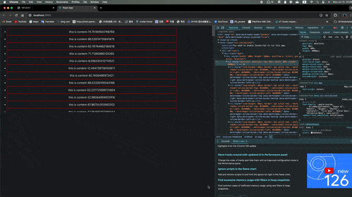

# 基于react的虚拟列表实现demo

虚拟化列表是仅渲染其项目子集并用占位符替换不可见项目的列表.虚拟化技术可以通过减少需要创建和更新的 `DOM` 节点数量来显著提高渲染长列表的性能.

## 构建步骤

要从头开始构建虚拟化列表,我们将遵循以下步骤：

### 为列表创建一个组件

构建虚拟化列表的第一步是创建一个代表列表的组件.我们可以创建一个以项目数组为 `state` 的功能组件
```typescript
class List extends React.Component<propType,stateType,any> {
    constructor(props:propType) {
        super(props)
        this.state={
            visibleItems:[],
        }
    }
    render() {
        return (
            <div>
                <ul>
                    {
                        this.state.visibleItems.map(
                            (item) => (
                                <li key={item.id}>{item.content}</li>
                            )
                        )
                    }
                </ul>
            </div>
        );    
    }
}
```
在此示例中,我们使用 `map` 方法迭代项目数组并将每个项目渲染为 `li` 元素.我们还为每个项目分配一个唯一键,以帮助 `React` 识别它们

### 规定容器高度和列表项高度

构建虚拟化列表的第二步是仅渲染列表项的子集.为此,我们需要知道每个项目的高度以及容纳列表的容器的高度.

```typescript
import React from "react"
export type item={
    id:string,
    content:string
}
type propType={
    items:item[],
    width?:number,
    height?:number,
    lineHeight?:number
}
type stateType={
    visibleItems:item[],
}
class List extends React.Component<propType,stateType,any> {
    constructor(props:propType) {
        super(props)
        this.state={
            visibleItems:[],
        }
    }
    render() {
        const {width,height=500,lineHeight=40,items}=this.props
        console.log('render')
        return (
            <div 
                style={{
                    width:width?`${width}px`:'100%',
                    height:`${height}px`,
                    overflowY:"scroll",
                    position:"relative"
                }} 
            >
                <ul
                    style={{
                        height:`${items.length * lineHeight-this.state.startIndex*lineHeight}px`,
                    }}
                >
                    {this.state.visibleItems.map((item) => (
                        <li key={item.id} style={{
                            lineHeight:`${lineHeight}px`,
                            border:"solid 1px red"
                        }}>{item.content}</li>
                    ))}
                </ul>
                
            </div>
        );    
    }
    
}
```
在此更新的示例中,我们向组件添加了 `lineHeight` 和 `Height` 属性

### 根据当前滑动距离进行切片

```typescript
export type item={
    id:string,
    content:string
}
type propType={
    items:item[],
    width?:number,
    height?:number,
    lineHeight?:number
}
type stateType={
    visibleItems:item[],
    startIndex:number,
    // invisibleItemsHeight:number
}
const container=React.createRef<HTMLDivElement>()
class List extends React.Component<propType,stateType,any> {
    constructor(props:propType) {
        super(props)
        this.state={
            visibleItems:[],
            startIndex:0,
        }
    }
    render() {
        const {width,height=500,lineHeight=40,items}=this.props
        console.log('render')
        return (
            <div 
                style={{
                    width:width?`${width}px`:'100%',
                    height:`${height}px`,
                    overflowY:"scroll",
                    position:"relative"
                }} 
                ref={container}
                onScroll={this.updList}
            >
                <ul
                    style={{
                        position:"absolute",
                        top:`${this.state.startIndex*lineHeight}px`,
                        width:"80%",
                        height:`${items.length * lineHeight-this.state.startIndex*lineHeight}px`,
                    }}
                >
                    {this.state.visibleItems.map((item) => (
                        <li key={item.id} style={{
                            lineHeight:`${lineHeight}px`,
                            border:"solid 1px red"
                        }}>{item.content}</li>
                    ))}
                </ul>
                
            </div>
        );    
    }
    componentDidMount(): void {
        this.updList()
    }
    updList=():void=>{
        const {items,lineHeight=40,height=500}=this.props
        const startIndex = Math.floor(container.current?.scrollTop as number/lineHeight)
        const endIndex=startIndex+Math.floor(height/lineHeight)
        // const invisibleItemsHeight = (startIndex + this.state.visibleItems.length - endIndex) * lineHeight;
        this.setState({
            visibleItems:items.slice(startIndex, endIndex),
            startIndex,
            // invisibleItemsHeight
        })
    }
    
}
```

我们根据 `lineHeight` 和 `height` 计算 `startIndex` 和 `endIndex`.`startIndex` 表示第一个可见项目的索引,`endIndex` 表示最后一个可见项目的索引.

然后我们使用切片方法从 `items` 数组中仅提取可见项

我们将可见项呈现为高度为 `items.length * lineHeight-startIndex*lineHeight` 的 `ul` 元素.我们还使用 `top` 属性定位容器,该属性等于 `startIndex * itemHeight`

最后,我们使用 `onScroll` 钩子调用 `updList` 函数以在用户滚动时更新 `visibleItems`和`startIndex` 状态

## 运行效果

